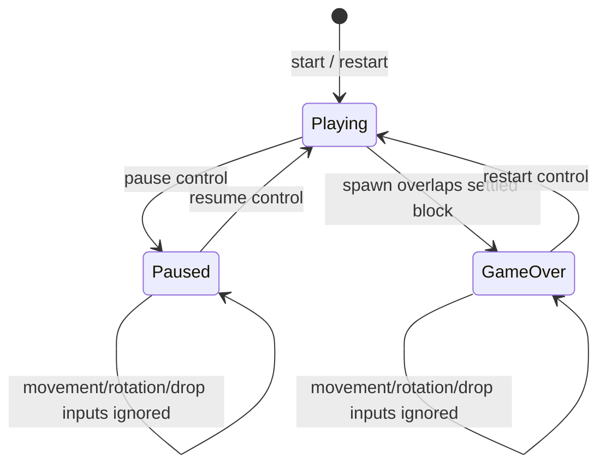
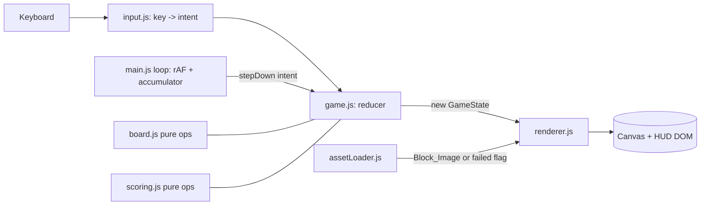

# Design Document

## Overview

This design describes a classic Tetris game implemented in vanilla HTML, CSS, and JavaScript with no build step and no framework, so it can be committed to a repository and served directly from GitHub Pages over static hosting (Requirements 18.1–18.4). The game runs entirely in the browser: a 10-column by 20-row playfield, the 7 standard tetrominoes, movement, clockwise rotation (no wall kicks), collision detection, automatic fall and locking, line clears, standard scoring, level progression, increasing fall speed, game over and restart, pause and resume, and a next-piece preview.

The signature visual theme is image-based blocks: every active and settled cell is rendered using a provided image asset (a cat photo) scaled to a single cell, with a distinct per-shape tint so the 7 shapes stay distinguishable, and a per-shape solid-color fallback when the image fails to load (Requirements 2.3, 19.1–19.5).

### Goals

- Correct, standard Tetris behavior that matches the acceptance criteria.
- Zero-build, framework-free, GitHub Pages friendly (relative paths, static assets only).
- A clean separation between **pure game logic** (board, collision, line clear, scoring, level) and **side-effecting concerns** (DOM, canvas, timing, input), so the logic is unit- and property-testable without a browser or build step.
- A responsive layout usable down to a 320px viewport width (Requirements 17.4, 17.5).

### Non-Goals

- Wall kicks / SRS kick tables (rotation is simple clockwise with rejection on collision, Requirement 7.3).
- Hold piece, 7-bag randomizer (spawn is uniform random, Requirement 3.3), ghost piece, or networked high scores.
- A server or any runtime build tooling.

## Architecture

### File and Directory Structure

The project is a flat static site rooted at `index.html` so GitHub Pages can serve it directly, with all assets referenced by **relative** paths (Requirements 18.1, 18.3, 19.3):

```
tetris-game/                 (repository root served by GitHub Pages)
├── index.html               Entry point; markup, canvas elements, HUD, controls help
├── css/
│   └── styles.css           Layout, responsive rules, HUD, overlays
├── js/
│   ├── tetrominoes.js        Shape + rotation-state definitions, tints, fallback colors
│   ├── board.js              Pure board ops: collision, lock, line clear, bounds
│   ├── scoring.js            Pure scoring + level + fall-speed functions
│   ├── game.js               Game state machine (playing/paused/gameover), reducers
│   ├── input.js              Keyboard mapping -> intents (side-effecting listener)
│   ├── renderer.js           Canvas rendering of board, active piece, preview
│   ├── assetLoader.js        Block_Image loader with load/failure signal + fallback
│   └── main.js               Wires modules together: loop, timing, bootstrapping
├── assets/
│   └── block.jpg            Block_Image: the provided cat photo, copied + renamed
└── tests/
    ├── test-runner.html      Opens in a browser, runs all tests, prints results
    ├── prng.js               Seedable PRNG + simple property-test harness (vanilla)
    └── *.test.js             Unit + property tests for pure logic modules
```

Modules are loaded as native ES modules (`<script type="module" src="js/main.js">`), which require no bundler and work from static hosting. Pure-logic modules (`tetrominoes.js`, `board.js`, `scoring.js`, and the reducer functions in `game.js`) import nothing from the DOM, so the same files are imported directly by tests.

> Design decision — ES modules vs single `script.js`: Native ES modules keep the testable logic importable in isolation with no build step, satisfying the "no runtime build step" constraint (Requirement 18.2) while still giving clean module boundaries. A single `script.js` would also work but makes isolating pure logic for property tests harder. If a target environment cannot use `type="module"` from `file://`, the same modules can be concatenated manually, but GitHub Pages serves over HTTPS so modules load normally (Requirement 18.4).

### Asset Setup

The provided source image at the workspace root, `WhatsApp Image 2026-10-02 at 2.21.38 PM.jpeg`, is copied and renamed into the repo as `assets/block.jpg`. The clean, space-free, relative filename keeps paths GitHub Pages friendly and avoids URL-encoding issues (Requirements 19.2, 19.3). The original file is left in place; the implementation task copies it rather than moving it.

### Rendering Approach

**Recommendation: Canvas 2D.** The playfield and the next-piece preview are each a `<canvas>`. The renderer draws from game state every frame (or on every state change).

Rationale:
- The block theme requires drawing an image into each cell and then applying a per-shape tint. Canvas does this directly: `ctx.drawImage(blockImage, x, y, cell, cell)` to place the scaled image (Requirement 19.4), then a tint pass over the same cell rect (see below). A DOM grid would need 200 elements each with a background image plus an overlay element or blend layer, which is heavier and harder to tint consistently.
- A single `clearRect` + redraw is simple and fast at this scale (200 cells), and keeps rendering a pure function of state, which matches the "render from stored grid positions" criteria (Requirements 1.2, 1.3).
- Canvas keeps rendering concerns fully separate from the game-logic modules, supporting the testing strategy.

**Per-cell draw with image + tint.** For each occupied cell at pixel `(x, y)` with size `cell`:
1. If the Block_Image loaded: `ctx.drawImage(img, x, y, cell, cell)` to scale the image into the cell (Requirement 19.4). Then apply the shape tint by filling the same rect with the shape's tint color at reduced alpha (`ctx.globalAlpha = TINT_ALPHA; ctx.fillStyle = tint; ctx.fillRect(x, y, cell, cell); ctx.globalAlpha = 1`), optionally with `globalCompositeOperation = 'multiply'` for a richer tint, plus a 1px border in the tint color so adjacent same-shape cells read as separate blocks. This keeps the 7 shapes distinguishable while all using the one image (Requirements 2.3, 19.1).
2. If the Block_Image failed to load: fill the cell with the shape's **fallback solid color** instead of the image, keeping the game fully playable (Requirement 19.5).

Empty cells are left as the canvas background so occupied and empty cells are visually distinguishable (Requirement 1.4). Any cell whose grid position falls outside 10×20 is simply not drawn, leaving the rest of the rendered field intact (Requirements 1.5, 8.1, 8.2).

### Timing and Game Loop

A single loop driven by `requestAnimationFrame` tracks elapsed time. An accumulator compares elapsed time against the current `Fall_Speed` interval; each time the interval elapses during active play, the loop issues one automatic "step down" intent (Requirement 9.1). The loop only advances game state while `status === 'playing'`; in `paused` or `gameover` it renders but does not step, so the active piece does not fall (Requirements 14.3, 15.2). Using an accumulator (rather than `setInterval`) lets fall speed change immediately when the level changes and keeps timing decoupled from frame rate.

### State Machine



Status is one of `playing`, `paused`, `gameover`. Input intents other than pause/resume/restart are only applied while `playing`; they are ignored in `paused` and `gameover` (Requirements 7.4, 14.3, 15.3). Pause is ignored unless currently `playing` (Requirement 15.5).

### Data Flow



Input and the loop produce **intents**; `game.js` applies them to produce a new `GameState` using the pure `board.js` and `scoring.js` functions; the renderer draws the resulting state. This one-directional flow keeps logic deterministic and testable.

## Components and Interfaces

All signatures below are descriptive (vanilla JS, no type system). Pure modules never touch the DOM.

### tetrominoes.js (pure data)

- `SHAPES`: definition of the 7 tetrominoes, each with an ordered list of rotation states (see Data Models).
- `TINTS`: map of shape key -> tint color (rgba/hex) used over the Block_Image (Requirement 2.3).
- `FALLBACK_COLORS`: map of shape key -> solid color used when the image fails (Requirement 19.5).
- `rotationCount(shape)`: number of distinct orientations (1, 2, or 4).
- `cellsFor(shape, rotationIndex)`: returns the four `{r, c}` offsets for a given orientation.

### board.js (pure logic)

- `createBoard(rows=20, cols=10)`: returns a 2D grid of `null` (empty) cells.
- `inBounds(r, c)`: `0 <= c <= 9 && r <= 19` (top is open above row 0 for spawn math, but occupancy is only tracked within 0..19) (Requirements 8.1, 8.2).
- `isValidPosition(board, pieceCells)`: true iff every cell is within bounds and not on a Settled_Block (Requirements 8.1–8.3). Core predicate for move/rotate/drop.
- `lockPiece(board, pieceCells, shapeKey)`: returns a new board with those cells set to `shapeKey` (Requirements 9.3).
- `findFullRows(board)`: returns indices of rows where all 10 cells are occupied (Requirement 10.1).
- `clearRows(board, rowIndices)`: returns `{ board, cleared }` with full rows removed and all rows above each removed row shifted down by the count removed below them, preserving arrangement; empty rows added at top (Requirements 10.3, 10.4).
- `dropPosition(board, pieceCells)`: lowest valid offset for a hard drop (Requirement 6.1).

### scoring.js (pure logic)

- `lineScore(clearedCount, level)`: `0,100,300,500,800` indexed by `clearedCount`, multiplied by `level` (Requirements 11.2–11.5).
- `levelForLines(linesCleared)`: `1 + Math.floor(linesCleared / 10)` (Requirement 12.5).
- `fallSpeedForLevel(level)`: strictly decreasing in level, clamped to a minimum of 1ms, starting at 1000ms for level 1 (Requirements 13.1–13.3). Implementation: `Math.max(1, Math.round(1000 * Math.pow(DECAY, level - 1)))` with `0 < DECAY < 1`, or an equivalent strictly-decreasing clamped table.

### game.js (state + reducers, pure where possible)

- `newGame(seedPieceFn)`: returns an initial `GameState` with empty board, score 0, level 1, lines 0, status `playing`, an active piece spawned centered in rows 0–1, and a next piece (Requirements 3.1, 11.1, 12.1, 16.1).
- `spawn(state)`: moves `next` into `active` centered at top, draws a new `next`; if the spawned piece is not a valid position, transitions to `gameover` (Requirements 3.1–3.4, 14.1, 16.2).
- `tryMove(state, dr, dc)`: returns a new state with the active piece shifted if valid, else unchanged (Requirements 4.1–4.3, 5.1).
- `tryRotate(state)`: rotates clockwise to the next orientation if valid; single-orientation shapes unchanged; rejected if invalid (Requirements 7.1–7.3).
- `softDrop(state)`: move down one row; if blocked, lock instead (Requirements 5.1, 5.2).
- `hardDrop(state)`: move to `dropPosition` then lock (Requirements 6.1, 6.2).
- `stepDown(state)`: the automatic fall tick; move down one row, or lock if blocked (Requirements 9.1, 9.2).
- `lockAndResolve(state)`: lock active cells, find and clear full rows, update score/lines/level/fall speed, then spawn next (Requirements 9.3, 10.1–10.4, 11.2–11.5, 12.4, 12.5, 13.2).
- `pause(state)`, `resume(state)`, `restart(state, seedPieceFn)`: status transitions with the preservation / reset semantics in Requirements 14.4, 15.1–15.5.
- `applyIntent(state, intent)`: dispatcher that enforces which intents are allowed in which status (gatekeeper for Requirements 7.4, 14.3, 15.3, 15.5, 17.3).

### input.js (side-effecting)

- `attachInput(target, dispatch)`: adds a `keydown` listener mapping keys to intents and calling `dispatch(intent)`. Unmapped keys produce no intent (Requirement 17.3). Default mapping (Requirement 17.1):
  - `ArrowLeft` -> move left, `ArrowRight` -> move right
  - `ArrowDown` -> soft drop, `Space` -> hard drop
  - `ArrowUp` -> rotate clockwise
  - `P` -> pause/resume toggle, `R` -> restart
- The listener calls `preventDefault` for mapped keys (e.g. Space, arrows) to avoid page scrolling.

### renderer.js (side-effecting)

- `createRenderer(boardCanvas, previewCanvas, assets)`: returns `{ render(state) }`.
- `render(state)`: clears and redraws board cells, active piece, and preview from stored grid positions, using the Block_Image + tint or fallback color per cell (Requirements 1.2–1.4, 2.3, 16.1–16.3, 19.1, 19.4, 19.5). Also updates HUD text (score, level, lines) and shows/hides the paused and game-over overlays (Requirements 11.6, 12.2, 12.3, 14.2, 15.1).

### assetLoader.js (side-effecting)

- `loadBlockImage(src='assets/block.jpg')`: returns `{ image, status }` where status becomes `'ready'` on load or `'failed'` on error; exposes a boolean the renderer checks to choose image vs fallback (Requirement 19.5). On failure it also surfaces a visible notice in the HUD so the failure is observable, consistent with the asset-observability requirement (Requirements 18.5, 19.5).

### main.js (composition root)

- Loads the Block_Image, builds initial state, attaches input, starts the `requestAnimationFrame` loop with the fall-speed accumulator, and renders on each state change. Guards module load errors so a failed script is observable rather than silent (Requirement 18.5).

## Data Models

### Board

A 2D array `board[row][col]`, 20 rows × 10 cols. Each entry is either `null` (empty) or a shape key string (`'I' | 'O' | 'T' | 'S' | 'Z' | 'J' | 'L'`) identifying the Settled_Block's shape (so settled cells keep their tint/fallback color). Row 0 is the top; row 19 is the bottom. Occupied cells correspond to Settled_Blocks; empty cells render as background (Requirements 1.1, 1.2, 1.4).

### Tetromino Shape Definitions and Rotation States

Each shape is defined by its occupied cell offsets relative to a piece origin, with one entry per clockwise orientation. Shapes with fewer than 4 distinct orientations list only the distinct ones:

- `O`: 1 orientation (rotation is a no-op, Requirement 7.2).
- `I`, `S`, `Z`: 2 distinct orientations.
- `T`, `J`, `L`: 4 distinct orientations.

```
Piece = {
  key: 'I'|'O'|'T'|'S'|'Z'|'J'|'L',
  rotations: Array<Array<{ r: number, c: number }>>,  // one list of 4 offsets per orientation
}
```

Example (illustrative offsets within a bounding box):
```
T: [
  [ {r:0,c:1},{r:1,c:0},{r:1,c:1},{r:1,c:2} ],   // spawn
  [ {r:0,c:1},{r:1,c:1},{r:1,c:2},{r:2,c:1} ],   // CW 90
  [ {r:1,c:0},{r:1,c:1},{r:1,c:2},{r:2,c:1} ],   // CW 180
  [ {r:0,c:1},{r:1,c:0},{r:1,c:1},{r:2,c:1} ],   // CW 270
]
O: [ [ {r:0,c:0},{r:0,c:1},{r:1,c:0},{r:1,c:1} ] ]   // single orientation
```

### Active Piece (runtime)

```
ActivePiece = {
  key: shape key,
  rotationIndex: integer in [0, rotations.length),
  row: integer,       // origin row offset of the piece's bounding box
  col: integer,       // origin col offset
}
```
The four absolute cells are derived as `rotations[rotationIndex].map(o => ({ r: row + o.r, c: col + o.c }))`. Spawn centers the piece in rows 0–1, horizontally centered (`col ≈ 3` for most shapes) (Requirement 3.1).

### Tints and Fallback Colors

```
TINTS = { I:'#00f0f0', O:'#f0f000', T:'#a000f0', S:'#00f000', Z:'#f00000', J:'#0000f0', L:'#f0a000' }
FALLBACK_COLORS = same keys -> solid colors used when Block_Image fails
```
Standard Tetris color associations keep the 7 shapes distinguishable both over the image (as tint) and as fallback fills (Requirements 2.3, 19.5).

### GameState

```
GameState = {
  board: Board,                     // 20x10 of null | shapeKey
  active: ActivePiece,              // current falling piece
  next: shape key,                  // next piece type for the preview (Req 16)
  score: non-negative integer,      // Req 11
  level: positive integer,          // Req 12
  linesCleared: non-negative int,   // Lines_Cleared_Counter, Req 12
  status: 'playing'|'paused'|'gameover',  // state machine
  fallSpeedMs: positive integer,    // current Fall_Speed, >= 1 (Req 13)
}
```
`fallSpeedMs` is derived from `level` via `fallSpeedForLevel`; it is stored for the loop's convenience and recomputed whenever the level changes.

### Intents

```
Intent = 'moveLeft' | 'moveRight' | 'softDrop' | 'hardDrop' | 'rotate'
       | 'pauseToggle' | 'restart' | 'stepDown'
```
`stepDown` originates from the loop; the rest originate from input. `applyIntent` enforces status rules before mutating.

## Correctness Properties

*A property is a characteristic or behavior that should hold true across all valid executions of a system — essentially, a formal statement about what the system should do. Properties serve as the bridge between human-readable specifications and machine-verifiable correctness guarantees.*

These properties target the **pure logic** (`board.js`, `scoring.js`, `tetrominoes.js`, and the reducer functions in `game.js`). Rendering, timing, layout, and deployment concerns are verified by the unit/integration/smoke tests described in the Testing Strategy rather than by properties, because they are side-effecting or non-input-varying.

### Property 1: Collision predicate is correct

*For any* board and *any* set of piece cells, `isValidPosition(board, cells)` returns true if and only if every cell has `0 <= col <= 9` and `row <= 19` and no cell lands on a Settled_Block; a cell with column `< 0` or `> 9`, or row `> 19`, or coinciding with a settled block makes the position invalid.

**Validates: Requirements 8.1, 8.2, 8.3, 1.5**

### Property 2: The active piece is always in a valid position

*For any* reachable `GameState` and *any* `Intent`, after `applyIntent(state, intent)` the resulting active piece (if the status is still `playing`) occupies only in-bounds cells and never overlaps a Settled_Block. No move, rotation, soft drop, hard drop, or auto step ever leaves the active piece in an invalid position.

**Validates: Requirements 4.3, 7.3, 8.4**

### Property 3: A valid single step moves exactly one cell in one direction

*For any* `GameState` where a one-step move in a chosen direction (left, right, or down) is valid, applying that move changes the active piece's position by exactly one column (left/right) or one row (down), leaves the other coordinate and the rotation unchanged, and the board is unchanged.

**Validates: Requirements 4.1, 4.2, 5.1, 9.1**

### Property 4: Blocked downward movement locks the piece

*For any* `GameState` where moving the active piece down one row is invalid, applying a soft drop, an automatic step, or completing a hard drop converts the active piece's current four cells into Settled_Blocks on the board at their current positions.

**Validates: Requirements 5.2, 6.2, 9.2**

### Property 5: Locking adds exactly four occupied cells

*For any* board and *any* active piece whose four cells are empty and in bounds, `lockPiece` returns a board whose occupied-cell count is exactly four greater than the input board's, with the four new occupied cells at exactly the piece's grid positions and all other cells unchanged.

**Validates: Requirements 9.3**

### Property 6: Hard drop lands at the lowest valid position

*For any* `GameState`, after a hard drop the piece's pre-lock position is valid and moving it down one more row would be invalid (it rests on the floor or on a Settled_Block).

**Validates: Requirements 6.1**

### Property 7: Rotation is a cycle (four rotations return to origin)

*For any* `GameState` where each intermediate rotation is unobstructed, applying `tryRotate` a number of times equal to the shape's orientation count returns the active piece to its original orientation and cells; for a single-orientation shape (O), a single `tryRotate` leaves the orientation and cells unchanged; a valid rotation advances `rotationIndex` by one modulo the orientation count.

**Validates: Requirements 7.1, 7.2**

### Property 8: Every tetromino orientation is exactly four connected cells

*For any* of the 7 shapes and *any* of its rotation states, `cellsFor` returns exactly four distinct cells that form a single connected (edge-adjacent) group.

**Validates: Requirements 2.2**

### Property 9: Spawned and next shapes are always valid shape keys

*For any* random seed, the shape chosen for spawning and the `next` preview shape are always one of exactly the 7 standard keys (I, O, T, S, Z, J, L); after any `spawn`, `next` is refreshed to a valid key.

**Validates: Requirements 2.4, 3.3, 16.1, 16.2**

### Property 10: Overlapping spawn triggers game over

*For any* board whose cells at a shape's spawn position are already occupied by Settled_Blocks, spawning that shape transitions the game to the `gameover` status.

**Validates: Requirements 3.4, 14.1**

### Property 11: `findFullRows` identifies exactly the complete rows

*For any* board, `findFullRows` returns exactly the indices of rows in which all 10 cells are occupied, and no others.

**Validates: Requirements 10.1**

### Property 12: Clearing with no full rows is a no-op

*For any* board that contains no fully occupied row, the line-clear operation leaves the board unchanged.

**Validates: Requirements 10.2**

### Property 13: Line clear conserves surviving blocks and removes exactly 10 per cleared row

*For any* board, after clearing its full rows: the board still has 20 rows by 10 columns; the total occupied-cell count equals the original count minus 10 times the number of cleared rows; and the multiset of blocks that were not in any cleared row is preserved (none lost, none duplicated), shifted downward so their relative arrangement is unchanged.

**Validates: Requirements 10.3, 10.4**

### Property 14: Line score is base-by-count times level

*For any* level ≥ 1 and *any* cleared-row count n in {1, 2, 3, 4}, the awarded score equals `{1:100, 2:300, 3:500, 4:800}[n] * level`.

**Validates: Requirements 11.2, 11.3, 11.4, 11.5**

### Property 15: Lines counter increases by rows removed

*For any* `GameState` and *any* line-clear that removes k rows, the Lines_Cleared_Counter after the clear equals its previous value plus k.

**Validates: Requirements 12.4**

### Property 16: Level equals one plus floor(lines / 10)

*For any* non-negative Lines_Cleared_Counter value, `levelForLines(lines)` equals `1 + floor(lines / 10)`.

**Validates: Requirements 12.5**

### Property 17: Fall speed is strictly decreasing and bounded below

*For any* level n ≥ 1, `fallSpeedForLevel(n)` is at least 1 millisecond, and `fallSpeedForLevel(n + 1)` is strictly less than `fallSpeedForLevel(n)` whenever `fallSpeedForLevel(n)` is above the 1ms floor; `fallSpeedForLevel(1)` equals 1000.

**Validates: Requirements 13.1, 13.2, 13.3**

### Property 18: Non-playing status ignores gameplay intents

*For any* `GameState` whose status is `paused` or `gameover`, applying any gameplay intent (move left/right, rotate, soft drop, hard drop, auto step) returns a state equal to the input; while `gameover`, a pause toggle also leaves the state unchanged.

**Validates: Requirements 7.4, 14.3, 15.3, 15.5**

### Property 19: Pause then resume is an identity round-trip

*For any* `playing` `GameState`, `pause` changes only the status to `paused` and preserves the board, score, level, lines counter, and active piece; applying resume afterward returns a state equal to the original, with automatic falling re-enabled.

**Validates: Requirements 15.1, 15.2, 15.4**

### Property 20: Restart yields a canonical fresh game

*For any* prior `GameState`, restart produces a state with an empty board, score 0, level 1, Lines_Cleared_Counter 0, status `playing`, no game-over indication, and a freshly spawned active piece.

**Validates: Requirements 14.4**

### Property 21: Unmapped keys produce no intent

*For any* keyboard key not present in the control map, input handling produces no intent, so the game state is left unchanged.

**Validates: Requirements 17.3**

### Property 22: Each shape has a distinct tint and a defined fallback color

*For any* pair of distinct shapes, their tint colors differ; and every one of the 7 shapes has a defined fallback solid color, so the shapes remain mutually distinguishable both over the Block_Image and when the image fails to load.

**Validates: Requirements 2.3, 19.5**

## Error Handling

- **Block_Image fails to load (Requirements 18.5, 19.5):** `assetLoader.js` attaches an `onerror` handler that sets the image status to `'failed'`. The renderer checks this flag and fills occupied cells with each shape's `FALLBACK_COLORS` value instead of the image, so the game stays fully playable. The loader also writes a visible notice into the HUD (and logs to the console) so the failure is observable rather than silent.
- **Invalid spawn → game over (Requirements 3.4, 14.1):** `spawn` validates the spawned piece via `isValidPosition`. If the spawn cells overlap a Settled_Block, the game transitions to `gameover` instead of placing an invalid piece. The game-over overlay stays visible until restart.
- **Input while paused or over (Requirements 7.4, 14.3, 15.3, 15.5):** `applyIntent` is the single gatekeeper. In `paused`/`gameover` it rejects gameplay intents and returns the state unchanged; pause is ignored unless `playing`.
- **Unmapped keys (Requirement 17.3):** `input.js` only dispatches intents for mapped keys; everything else is a no-op (and does not call `preventDefault`).
- **Out-of-bounds grid references (Requirements 1.5, 8.1, 8.2):** `isValidPosition` rejects any out-of-bounds position before it can be applied, and the renderer skips drawing any cell outside 10×20, so the existing rendered field is preserved.
- **Invalid shape request (Requirement 2.5):** Spawn selection only ever draws from the 7-key set; a defensive guard treats any non-standard key as a no-op that preserves the current board.
- **Missing CSS/JS asset (Requirement 18.5):** `index.html` includes a small inline bootstrap guard; if the main module throws or fails to load, a visible error banner is shown rather than leaving a blank, non-functional page. Module scripts also surface load errors to the console.

## Testing Strategy

The guiding principle is **separation of pure logic from side effects**. All game rules live in dependency-free modules (`board.js`, `scoring.js`, `tetrominoes.js`, and the reducers in `game.js`) that import nothing from the DOM. These are imported directly by test files, so the full rule set is testable with no browser APIs and no build step. Rendering (`renderer.js`), input binding (`input.js`), timing (`main.js`), and the Block_Image loader are kept thin and verified separately.

### Running tests without a build step

Tests run in the browser via `tests/test-runner.html`, which loads a tiny hand-written harness (`tests/prng.js`) and the `*.test.js` files as ES modules and prints pass/fail results to the page and console. No bundler, no npm scripts, no CI tooling are required — opening the file over a local static server (or GitHub Pages) runs everything. This keeps the project build-free (Requirement 18.2) while still giving automated coverage. (Optionally the same ES modules can be run under a zero-config runner like Node's built-in test runner if a developer prefers a terminal, but that is not required.)

### Property-based testing

Because PBT suits this feature (pure functions with large input spaces — boards, pieces, rotations, scores), the project includes a small vanilla property-test harness in `tests/prng.js`:
- A **seedable PRNG** (e.g. mulberry32) for reproducible runs and shrink-friendly, deterministic failures.
- Generators for: random boards (with configurable fill, including boards engineered to have full rows), random shapes, random orientations, random active-piece positions, and random reachable `GameState`s.
- A `forAll(generator, predicate, { iterations })` driver that runs **at least 100 iterations** per property and reports the failing input on the first counterexample.

Each of the 22 correctness properties above is implemented as a **single** property-based test, each tagged with a comment in the form:

```
// Feature: tetris-game, Property 13: Line clear conserves surviving blocks and removes exactly 10 per cleared row
```

so every test traces back to its design property and, through it, to the requirements it validates.

Highest-value properties to prioritize: Property 2 (active piece always valid), Property 13 (line clear conserves blocks — the classic place to lose/duplicate blocks), Property 7 (rotation cycle), and Property 17 (fall-speed monotonicity).

### Unit tests (example-based)

Unit tests cover the fixed, non-input-varying criteria and concrete edge cases, kept intentionally lean since properties cover broad input ranges:
- Board is exactly 20×10 / 200 cells (Requirement 1.1).
- `SHAPES` contains exactly the 7 keys (Requirement 2.1).
- `newGame` initial values: score 0, level 1, lines 0, status `playing`, a next shape present (Requirements 11.1, 12.1, 16.1).
- `fallSpeedForLevel(1) === 1000` (Requirement 13.1).
- Control map covers move/soft/hard/rotate/pause/resume/restart (Requirement 17.1).
- Edge cases: all-whitespace / invalid shape key is a no-op (Requirements 2.5); clearing 1–4 simultaneous rows produces correct score and shift (spot-checks alongside Property 13/14); image-status `'failed'` makes the renderer pick fallback colors (Requirements 18.5, 19.5).

### Integration and smoke checks (manual / thin)

These verify side-effecting concerns that are not meaningful as properties:
- **Rendering (Requirements 1.2–1.4, 2.3, 16.1–16.3, 19.1, 19.4):** visual check that occupied cells draw the Block_Image scaled to one cell with per-shape tint, empty cells show background, and the preview shows the next shape.
- **Responsive layout (Requirements 17.4, 17.5):** manual check at 320px width and on resize — no horizontal scrolling.
- **Controls help (Requirement 17.2):** the help text listing each key is present in `index.html`.
- **Deployment (Requirements 18.1–18.4):** confirm `index.html` at root, all paths relative, loads and plays over HTTPS from GitHub Pages with no server code.
- **Asset presence (Requirements 19.2, 19.3):** `assets/block.jpg` exists and is referenced by a relative path.
- **Asset failure observability (Requirements 18.5, 19.5):** temporarily point the image at a bad path and confirm the fallback colors render and a visible notice appears.
